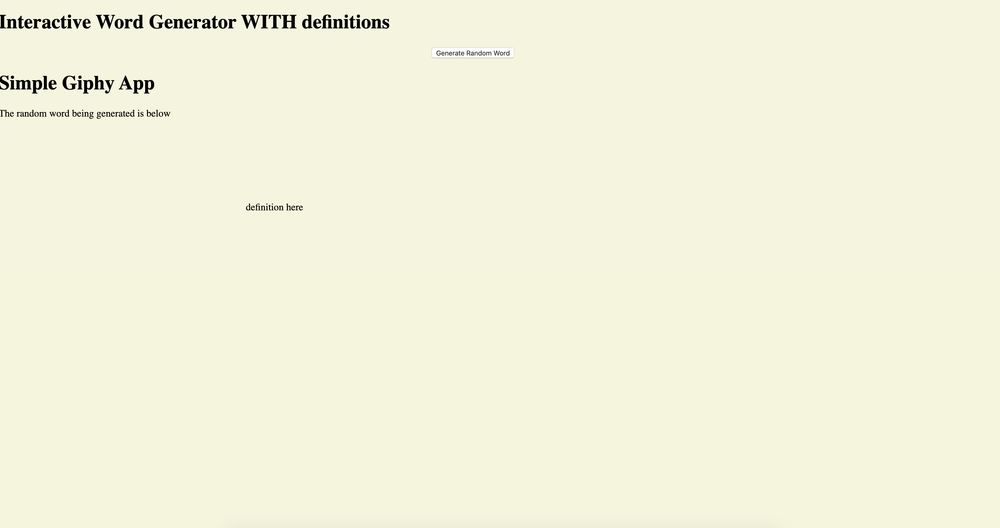

# random word generator

This application allows users to generate a random word, receive the definition of the word(if available) then see a gif (if available)

# Link to Live Site:

https://zikregiphy.netlify.com/

## How It's Made:

## Tech Used:

HTML, CSS , JS & 3 API

This site was the culmination of all the lessons I'd learned thus far about API's. I was challenged to use two API's and make them interact with each other. I used 3. I was proud to use a random word generator that would display and then send said random word into a dictionary API and Giphy Api so that users could see the meaning of the word and a GIF associated with it.

## Links to Other Sites:

https://zikredog.netlify.com

https://zikrestock.netlify.com

https://zikreweather.netlify.com

https://zikrenasa.netlify.com/
